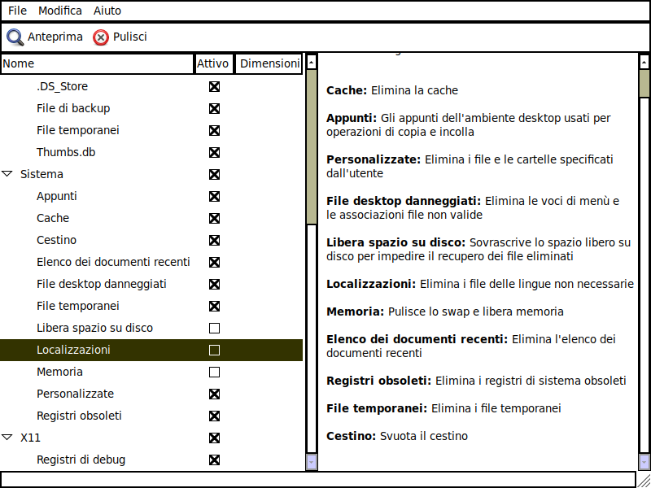

# Creiamo una nostra remix

## Prerequisiti

Installiamo la nostra distribuzione preferita Debian Buster o derivata ed andiamo ad installare eggs con uno dei metodi descritti in precedenza. 

Installiamo eggs ed assicuriamoci di caricare i prerequisiti e creare i file di configurazione dando il comando

`eggs prerequisites`

Oltre all'installazione dei vari pacchetti Debian necessari, verrà creato il file di configurazione con le impostazioni di default.  Trovate il file di configurazione in /etc/penguins-eggs.conf e potete eventualmente editarlo per modificare le impostazioni. Trovate la documentazione delle opzioni utilizzate direttamente nei commenti del file stesso.

A questo punto eggs è pronto a funzionare e creare l'immagine iso del nostro sistema. 

### Aggiunta dell'installer grafico Calamares

Nel caso si desideri utilizzare calamares come installer grafico, conviene installarlo adesso. 

Basterà procedere con il comando:

`eggs calamares`

In alternativa, se non volte calamares,   editate il file di installazione `/etc/penguins-eggs.conf` ed impostare `force_installer=No` altrimenti eggs lo installerà per suo conto.

Successivamente questa immagine dovrà essere posta su una chiavetta o un disco DVD e potrà essere reinstallarla o con l'installer grafico calamares oppure - in maniera più spartana - con il proprio installer cli. Per l'installer grafico calamares basterà lasciare il file di configurazione così come è, mentre se si decide di non usare calamares occore editare il file di configurazione  /etc/penguins-eggs.com e porre force-installer=no-

Consiglio, inoltre di installare bleachbit perchè ci consentirà di pulire facilmente le nostre remix senza masterizzare dati inutili. Potete falrlo anche da terminale con il comando:

`apt install bleachbit`

### Ripuliamo il nostro sistema

Per prima cosa - per questo abbiamo installato bleachbit - vi suggerisco di pulire il vostro sistema. 

Normalmente faccio pulire tutto a bleachbit tranne le localizzazione - altrimenti non funzionano le lingue estere - libera spazio su disco e Memoria. 

Si risparmiano almeno 200 MB che non sono pochi e sarebbero solamente zavorra.

### Produzione della iso

Una volta installato eggs ed i suoi prerequisiti, siamo pronti al grande salto.

`sudo eggs produce`

Con questo comando si avvia la costruzione dell'_uovo di pinguino_ che consiste sostanzialmente in tre fasi:

* creazione di una immagine del fs montata con overlayfs - che è istantanea e senza alcuna copia dei dati - per permettere le modifiche per la realizzazione del filesystem per l'immagine;
* compressione dell'intero filesystem in /home/eggs/work/iso/live/filesystem.squashfs;
* generazione dell'immagine iso dalla struttura precedente in /home/eggs/basename-X64\_AAAA-MM-GG-HHMM.iso

Il processo ha una certa pesantezza - inutile nasconderlo - non ve la prendete ne' con la copia del filesystem che non si effettua proprio e neppure con l'interfaccia grafica - visto che non ne facciamo uso. 

La pesantezza è data dal fatto che dobbiamo comprimere l'intero filesystem. 

Durante le prove però o comunque quando lo riteniate opportuno, vi consiglio di usare produce con l'opzione -f  o --fast. Facendo così si utilizzerà l'algoitmo di compressione lz4 invece di del più "pesante" xz e si dimezzerà il tempo di esecuzione. Per la versione finale, una volta controllato che sia tutto a posto potremo invece utilizzare la compressione di default per ottenere una iso più snella, oppure l'opzione -c  --compress che comprime ancora un po' di più, al prezzo di una ulteriore lentezza.

Come era inizialmente riportato anche nel codice, il suggerimento è prendersi un caffè nel frattempo e cercare di riservare abbastanza potenza di elaborazione alla macchina. Nel mio caso - utilizzo una macchina virtuale con 4 core e 4 GB di memoria - per un filesystem di 7/8 GB occorrono circa _dieci minuti_ con la compressione xz, mentre utilizzando la compressione lz4 si riduce moltissimo l'attesa solo un _minuto e mezzo_.  Per il caffè non facciamo più in tempo, una sigaretta fa male e l'immagine ottenuta passa a _3,0 GB_ a fronte dei _2.00_ GB della compressione xz \(Vedi **nota**\).

Una sola raccomandazione. Normalmente si da questo comando sulla macchina dove si lavora e magari si è già prodotta una versione precedente. Raccomando di cancellare le immagini precedenti con il comando `sudo eggs kill` che rimuove l'intero albero di directory sotto /home/eggs\).

**Nota**: _Non tutto il male vien per nuocere però. Se consideriamo che attualmente i DVD  si usano relativamente poco e le chiavette stanno diventando sempre più veloci, vi sono  casi la nostra remix potrebbe essere risultare più ottimizzata con un filesystem più grande ma meno compresso! Difatti, tenuto conto che durante l'uso - nascosto ai nostri occhi - ci sarà un continuo processo di lettura e decompressione del filesystem,  la decompressioone xz risulta comunque più lenta di quella lz4._ 

_Tenendo pure presente che non esiste più il limite delle dimensioni delle immagini iso a 4 GB, la soluzione di utilizzare sempre lz4 potrebbe rivelarsi doppiamente vantaggiosa, soprattutto in caso  di utilizzo con le macchine virtuali che  - quasi sempre - leggono direttamente  il file immagine su disco fisso invece di un reale DVD.  Inoltre, tutti i principali programmi per la creazione di chiavette avviabili  leggono i file iso._ 

_Perchè produrre , quindi, formati diversi ?_

_Eventualmente, si potrebbe creare la iso con lz4 e, successivamente, comprimere  la stessa con xz per alleggerire gli upload  ed i download su internet_.

