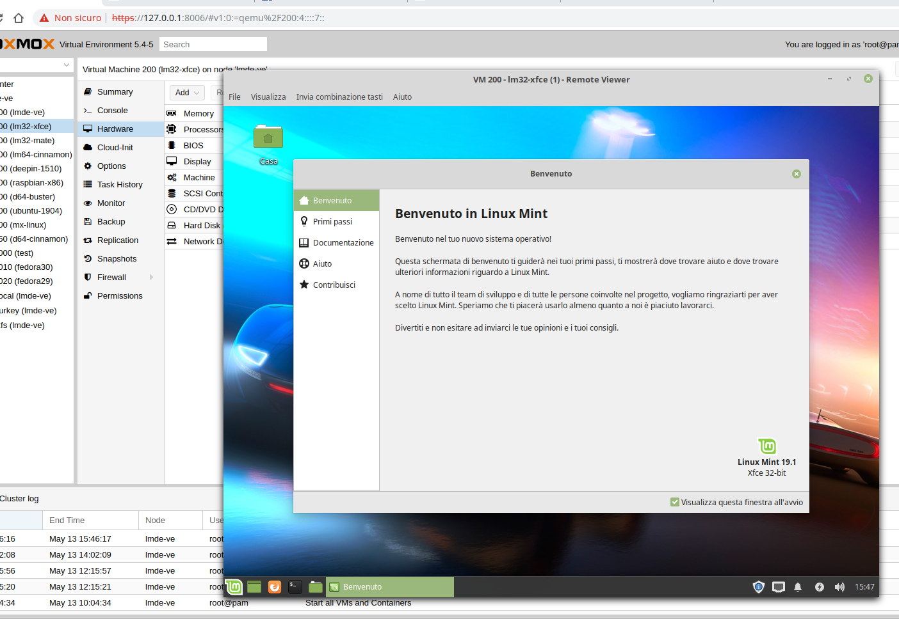

# Scarica le immagini ISO

## Premessa

Sono qui riportate una serie di remix realizzate da me stesso e create con Penguin's eggs. Non è mio scopo quello di realizzare una nuova remix, preferisco piuttosto costruire e mantenere il pacchetto. Però anche in questo vale il detto: nasce prima l'uovo o la gallina? Ed alcune remix le faccio e continuo a proporle.

Si tratta essenzialmente di versioni di Debian Buster, anche se rilascerò una versione minima di ubuntu con gli strumenti per lo sviluppo Typescript. 

Attualmente sono on line delle derivate di Debian Buster, less è una versione leggera - solo il necessario per lo sviluppo, che normalmente uso. Debu, più comoda e rifinita, sempre con gli strumenti di sviluppo e tutto il necessario per office, disegno, sviluppo etc. Debu ha il solo torto - rispetto a less - che essendo relativamente grande, 1,9 GB a fronte dei 900KB di less impiega più tempo per la "riproduzione".

E' presente anche una versione ancora più leggera, denominata naked senza nessuna interfaccia grafica ma utile come base.

In sostanza consiglio debu o less per chi voglia partecipare allo sviluppo, naked per chi vuole partire da una base per poi procedere alla creazione propria remix. Infine, ma non sono esperto della materia, ho realizzato una versione denominata blockchain per lo studio della stessa. Potrebbe essere insteressante per gli esperti del settore, non tanto per l'uso personale ma per relizzare demo e chiavette eventualmente installabili per divulgazione.

### Dove posso scaricare le iso

Tutte le versioni sono scaricabili da **sourgeforge.net** cercando il progetto [penguins-eggs](https://sourceforge.net/projects/penguins-eggs/files/).

#### User e password

Tutte le distribuzioni qui riportate sono impostate con user live ed user di root.

live/evolution

root/evolution

### Video

Questo è un vecchio video, vorrei farne altri, magari prossimamente.

