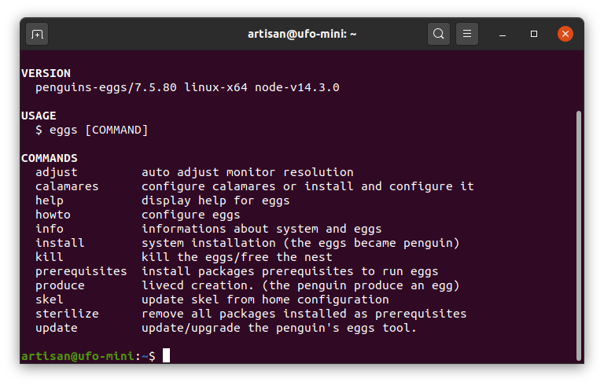
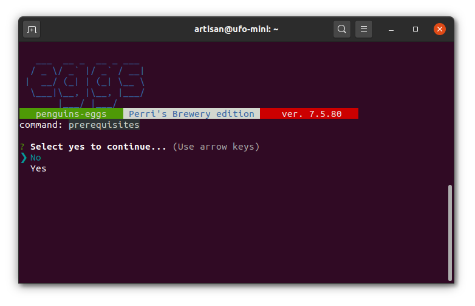

# Prerequisiti e configurazione

Una volta installato il pacchetto come nella pagina precedente, disporremo sul nostro sistema di un nuovo comando: 

`eggs`

Avviano eggs senza alcun comando otterremo la lista dei comandi disponibili:

La prima cosa che dobbiamo fare a questo punto è permettere ad eggs di scaricare i pacchetti Debian necessari al suo funzionamento. Per far questo basterà avviare il comando

sudo eggs prerequisites

Selezionando Yes verrà accettata l'installazione dei pacchetti necessari al funzionamento di eggs ed alla produzione delle immagini iso. Essenzialmente possiamo divide in tre i pacchetti installti:

1. Pacchetti per avvio su macchine UEFI
2. Pacchetti per la creazione dell'immagine iso
3. Pacchetti per l'installer grafico calamares

Tutti i pacchetti per il funzionamento di eggs e la produzione di iso sono installati dal comando 

`eggs prerequisites`

Installerà, quindi, i seguenti pacchetti;

`isolinux, live-boot, live-boot-initramfs-tools, lvm2, squashfs-tools, xorriso, xterm, whois`

### sudo eggs calamares

A questo punto, se ne abbiamo la necessità converrà installare anche l'installer grafico calamares, con il comando 

sudo eggs calamares

che installerà calamares ed i moduli `qml-module-qtquick2, qml-module-qtquick-controls` necessari per la visualizzazione delle slide durante l'installazione del sistema.

### Realizzazione di immagini iso compatibili UEFI

se vogliamo che le nostre iso vengano create compatibili UEFI \(Attenzione questo è stato testato solamente con Debian Buster, probabilmente in Ubuntu ancora non va\) dobbiamo installare il pacchetto grub-efi-amd64, con il comando.

`apt install grub-efi-amd64`

\(vedi **Nota**\)

### File di configurazione penguins-eggs.conf

Normalmente non è necessario intervenire su /etc/penguins-eggs.conf,  eggs si autoconfigura e adattandosi alle bisogna della distro presente. Ad ogni modo per la documentazione si rimanda ai commenti presenti sullo stesso file.

Mi preme solo segnalare che editando questo file si può modificare sia nome dell'utente della live, che la sua password e quella di amministrazione.

Se avete scelto di non toccare per il momento /etc/penguins-eggs.conf, si ricorda che per default eggs è configurato con user **live** e password **evolution**, la stessa password è impostata per il login di root.

Se invece avete modificato o cancellato il file di configurazione, potete sempre ripristinarlo con il comando:

`sudo eggs prerequisites -c`

### eggs è pronto!

Bene, adesso siamo finalmente pronti ad utilizzare eggs per la riproduzione del nostro pinguino.

_**Nota**: nel caso desideriamo creare una immagine avviabile in modalità UEFI ed abbiamo installato grub-efi-amd64 dopo aver installato i prerequisiti , occorre andare ad editare il file /etc/penguins-eggs.conf ed impostare make\_efi=yes._

| \_\_ |  |
| :--- | :--- |
|  |  |

