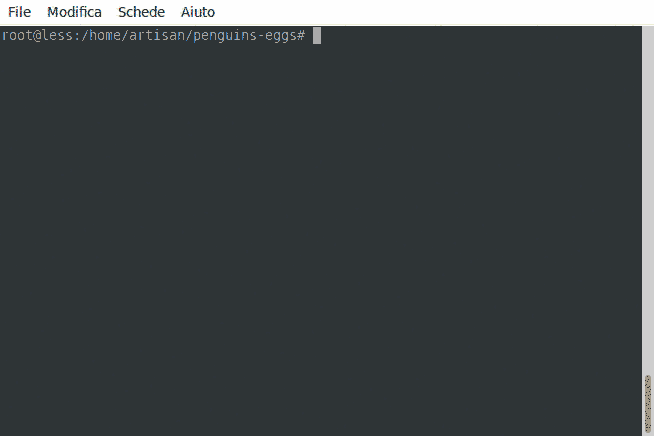

# Producing an iso image

There is not so much to write, just remember who can choose different flags. In this case we choose --fast fpr lz4 compression.

```
$ sudo eggs produce --fast
```


You will see the process in the real time, running in a virtual machine, with 2048 MB RAM, 2 sockets and 2 core. Virtual hard disk is on SSD.




**Ok**, we just finish to produce our iso image. Just need to use it to boot another machine.

