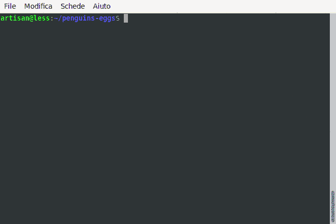

# Play with help

We will see how get help from eggs. 

Just run eggs without commands to have the full commands list.

```bash
Perri's Brewery edition: remaster your system and distribuite it

VERSION
  penguins-eggs/7.5.111 linux-x64 node-v14.3.0

USAGE
  $ eggs [COMMAND]

COMMANDS
  adjust         auto adjust monitor resolution
  calamares      configure calamares or install and configure it
  help           display help for eggs
  howto          configure eggs
  info           informations about system and eggs
  install        system installation (the eggs became penguin)
  kill           kill the eggs/free the nest
  prerequisites  install packages prerequisites to run eggs
  produce        livecd creation. (the penguin produce an egg)
  skel           update skel from home configuration
  sterilize      remove all packages installed as prerequisites
  update         update/upgrade the penguin's eggs tool.

```

Type eggs command --help or -h to have the description of the specific command and the list of flags

Example: eggs produce -h

```text
                       
   ___  __ _  __ _ ___ 
  / _ \/ _` |/ _` / __|
 |  __/ (_| | (_| \__ \
  \___|\__, |\__, |___/
       |___/ |___/     
   penguins-eggs    Perri's Brewery edition     ver. 7.5.111   
command: produce

livecd creation. (the penguin produce an egg)

USAGE
  $ eggs produce

OPTIONS
  -a, --assistant          assistant
  -b, --basename=basename  basename egg
  -c, --compress           max compression
  -d, --dry                perform a trial run, no mksquashfs, no mksiso
  -f, --fast               compression fast
  -h, --info               show CLI help
  -v, --verbose            verbose
  --branding=branding      branding for calamares

ALIASES
  $ eggs spawn
  $ eggs lay

EXAMPLE
  $ eggs produce --basename egg
  the penguin produce an egg called egg-i386-2020-04-13_1815.iso
```



