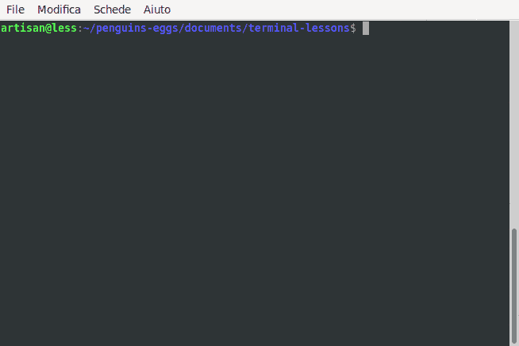

# install eggs \(deb package\)

## First: you must download it 

* open Your browser and go to the url [https://sourceforge.net/projects/penguins-eggs/](https://sourceforge.net/projects/penguins-eggs/)
* choose files, and and deb-packages
* choose the rigth version and download it.

## Second: open a windows terminal

* go to the directory where you saved the package

```text
$ cd ~/Downloads
```

* install the package, with the command:

```text
$ sudo dpkg -i eggs-7.5.112-1.deb
```


Eggs is a nodejs project, if You already have nodejs installed it's better to choose the npm package.





