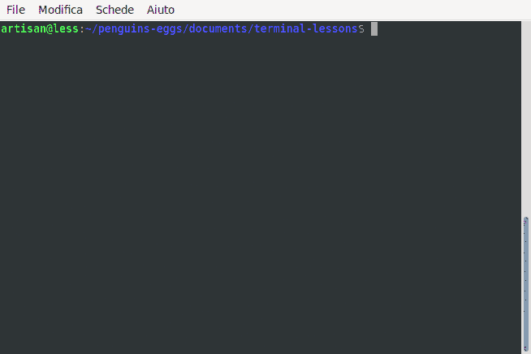

# install eggs \(npm package\)

## simple terminal lesson: how to install eggs \(npm package\)

Eggs is a node package, so the right way to install it is by the node package manager \(npm\)

In this way you will find automatically the last version and can update very simply:

```text
$ sudo eggs update
```

If you don't have nodejs installed, install it followind the instruction on \[nodesource\[\([https://github.com/nodesource/distributions\#deb](https://github.com/nodesource/distributions#deb)\)

Install eggs with npm is a simple task, you need two command:

```text
sudo npm config set unsafe-perm true
sudo npm -i penguins-eggs -g
```



## 

## 

