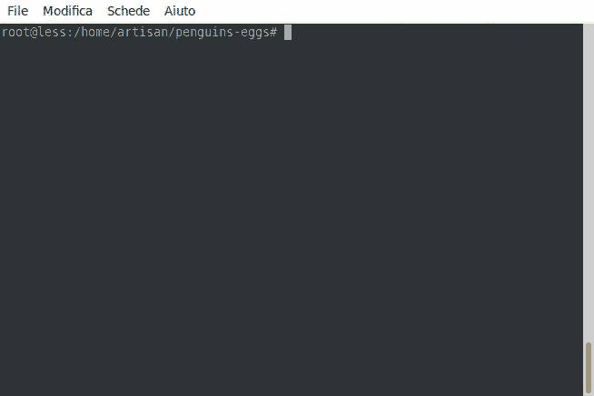

# Eggs prerequisites

We will see how to install the prerequisites packages necessary to produce eggs.

eggs is build on the following packages:

* isolinux
* live-boot
* live-boot-initramfs-tools
* lvm2
* squashfs-tools
* xorriso
* xterm'
* whois

If you chose to use the calamares as GUI installer, others packages will be included:

* calamares
* qml-module-qtquick2
* qml-module-qtquick-controls

finally, if you are building an UEFI image, you need too: 

* grub-efi-amd64

## Well, let's start!

